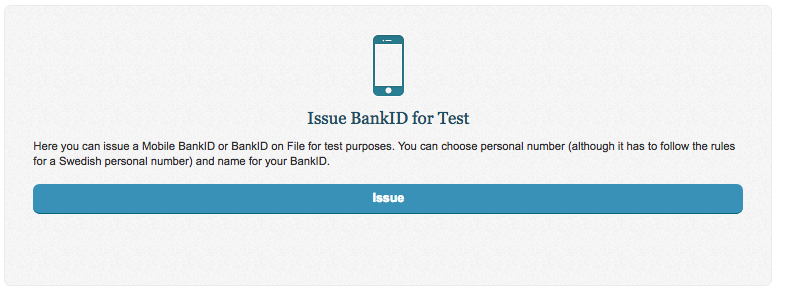
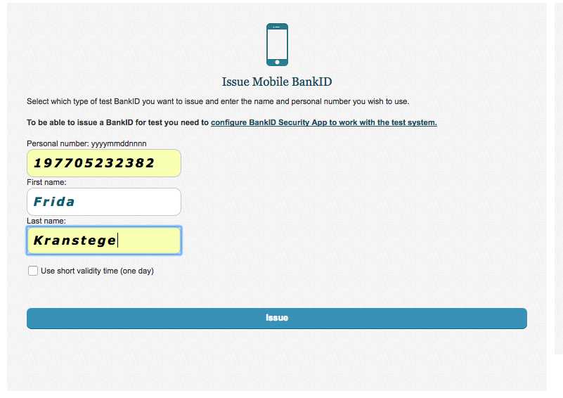

# Webcert
Webcert är en webbtjänst för att författa intyg samt ställa frågor och svar kring dem.

## Kom igång
Här hittar du grundläggande instruktioner för hur man kommer igång med projektet. Mer detaljerade instruktioner för att sätta upp sin utvecklingsmiljö och liknande hittar du på projektets [Wiki för utveckling](https://github.com/sklintyg/common/wiki).

### Bygg projektet
Webcert byggs med hjälp av Maven enligt följande:

    $ git clone https://github.com/sklintyg/webcert.git
    $ cd webcert
    $ ./gradlew clean build install -PcodeQuality
``

### Starta webbapplikationen
Webbapplikationen kan startas med Jetty enligt följande:

    $ cd webcert
    $ ./gradlew appRun
    $ open http://localhost:9088/welcome.html

Detta startar Webcert med stubbar för alla externa tjänster som Webcert använder. För att köra både Mina intyg och Webcert samtidigt behöver [Intygstjänsten](https://github.com/sklintyg/intygstjanst) startas före Mina intyg och Webcert.

### Starta webbapplikationen i debugläge
För att starta applikationen i debugläge används:

    $ cd webcert
    $ ./gradlew appRunDebug
    
Applikationen kommer då att starta upp med debugPort = **5007**. Det är denna port du ska använda när du sätter upp din 
debug-konfiguration i din utvecklingsmiljö.

### Starta specifik version
Man kan även starta Webcert i ett läge där endast de funktioner som är tillgängliga i en viss version är tillgängliga.

    $ ./gradlew appRun -Pv3.0

### Visa databasen
Man kan även komma åt H2-databasen som startas:

    $ open http://localhost:9090/

För att komma åt Webcert eller Intygsdatabasen fyll i JDBC URL'n :

WebCert 

    JDBC URL : jdbc:h2:tcp://localhost:9094/mem:dataSource

Intyg

    JDBC URL : jdbc:h2:tcp://localhost:9092/mem:dataSource

### Köra flera Webcert-instanser för dev-ändamål
(Detta avsnitt var skrivet specifikt för Maven, behöver uppdateras med gradle-instruktioner)

### Köra lokal webcert med fungerande testinloggning med BankID / Mobilt BankID
OBS! Kräver antingen kortläsare + kort samt testmodifierad BankID säkerhetsprogram _eller_ testklient för Mobilt BankID på telefon/platta med installerat testcertifikat

##### Testklient BankID
https://www.bankid.com/assets/bankid/rp/how-to-get-bankid-for-test-v1.4.pdf

##### Testklient Mobilt BankID
1. Gå hit: https://www.bankid.com/bankid-i-dina-tjanster/rp-info
2. Ladda hem APK: https://www.bankid.com/assets/bankid/rp/BankID_7.5.0_BGC_CUSTOMERTEST.apk (obs, länken ändras över tid)
3. Mejla APKn till din telefon eller motsvarande, installera. Du lär behöva ha satt telefonen i läget att man får installera okänd mjukvara.
4. https://www.bankid.com/assets/bankid/rp/how-to-get-bankid-for-test-v1.5.pdf är rörig värre, men där beskrivs hur man skaffar ett testcertifikat.

Ungefär så här:

1. Gå till https://demo.bankid.com/
2. Logga in med ditt _riktiga_ BankID / Mobila BankID
3. Välj Issue test BankID

4. Knappa in Frida Kranstege 197705232382

5. Följ instruktionerna. Du kommer behöva öppna Mobilt BankID-appen på testtelefonen, knappa in Fridas (eller annan hittepå-persons) personnummer samt den kod som visas på skärmen. Välj en kod (jag kör på 123654) och sen är det faktiskt klart!

##### Konfigurera Webcert

1. Se till att du har /webcert-konfiguration clonat och avkrypterat.

2. Öppna web/build.gradle och kommentera bort hela stycket med:

    jvmArgs = ["-Dcatalina.base=${buildDir}/catalina.base",
                   "-Dspring.profiles.active=dev,caching-enabled",
                   "-Dwebcert.resources.folder=${projectDir}/../src/main/resources",
                   "-Dcredentials.file=${projectDir}/webcert-credentials.properties",
                   "-Dwebcert.config.file=${projectDir}/webcert-dev.properties",
                   "-Dwebcert.logback.file=${projectDir}/webcert-logback.xml",
                   "-Dwebcert.useMinifiedJavaScript=${minified}",
                   "-Dh2.tcp.port=9094",
                   "-Dh2.web.port=9090",
                   "-Djetty.port=9088"]
                   
Ersätt ovanstående med nedanstående, byt ut _/Users/myuser/intyg_ mot egen absolut sökväg:

    jvmArgs = ["-Dcatalina.base=${buildDir}/catalina.base",
                   "-Dspring.profiles.active=dev,caching-enabled,wc-security-test",
                   "-Dwebcert.config.folder=/Users/myuser/intyg/webcert-konfiguration/test/",
                   "-Dwebcert.resources.folder=${projectDir}/../src/main/resources",
                   "-Dcredentials.file=/Users/myuser/intyg/webcert-konfiguration/test/credentials.properties",
                   "-Dwebcert.config.file=/Users/myuser/intyg/webcert-konfiguration/test/webcert.properties",
                   "-Dwebcert.logback.file=/Users/myuser/intyg/webcert-konfiguration/test/webcert-logback.xml",
                   "-Dwebcert.useMinifiedJavaScript=${minified}",
                   "-Dh2.tcp.port=9094",
                   "-Dh2.web.port=9090",
                   "-Djetty.port=9088",
                   "-Dwebcert.stubs.port=9088"]
                   
3. Modifiera /webcert-konfiguration/test/sp-eleg.xml så AssertionConsumerService Location pekar på ditt lokala LAN-ip. Ta reda på det mha _ifconfig_ eller motsvarande. I det här exemplet har jag LAN-ip 192.168.0.180

Ändra sp-eleg.xml så Location pekar på din lokala webcert via LAN-ip. Glöm inte porten. Kör du med _grunt server_ peka gärna på 9089:

    <?xml version="1.0" encoding="UTF-8"?>
    <md:EntityDescriptor xmlns:md="urn:oasis:names:tc:SAML:2.0:metadata" ID="webcert.intygstjanster.inera.se" entityID="eleg">
      <md:SPSSODescriptor AuthnRequestsSigned="false" WantAssertionsSigned="false" protocolSupportEnumeration="urn:oasis:names:tc:SAML:2.0:protocol">
    
        <md:SingleLogoutService Binding="urn:oasis:names:tc:SAML:2.0:bindings:HTTP-POST" Location="http://192.168.0.180:9089/saml/SingleLogout/alias/eleg"/>
        <md:SingleLogoutService Binding="urn:oasis:names:tc:SAML:2.0:bindings:HTTP-Redirect" Location="http://192.168.0.180:9089/saml/SingleLogout/alias/eleg"/>
        <md:NameIDFormat>urn:oasis:names:tc:SAML:1.1:nameid-format:emailAddress</md:NameIDFormat>
        <md:NameIDFormat>urn:oasis:names:tc:SAML:2.0:nameid-format:transient</md:NameIDFormat>
        <md:NameIDFormat>urn:oasis:names:tc:SAML:2.0:nameid-format:persistent</md:NameIDFormat>
        <md:NameIDFormat>urn:oasis:names:tc:SAML:1.1:nameid-format:unspecified</md:NameIDFormat>
        <md:NameIDFormat>urn:oasis:names:tc:SAML:1.1:nameid-format:X509SubjectName</md:NameIDFormat>
        <md:AssertionConsumerService Binding="urn:oasis:names:tc:SAML:2.0:bindings:HTTP-POST" Location="http://192.168.0.180:9089/saml/SSO/alias/eleg" index="0" isDefault="true"/>
        <md:AssertionConsumerService Binding="urn:oasis:names:tc:SAML:2.0:bindings:HTTP-Artifact" Location="http://192.168.0.180:9089/saml/SSO/alias/eleg" index="1"/>
      </md:SPSSODescriptor>
    </md:EntityDescriptor>
    
4. Starta webcert från /webcert/web

    ./gradlew appRun
    
5. Knappa in LAN-adressen till Webcert i din webbläsares adressfält, t.ex: http://192.168.0.180:9089/

Klicka på "E-legitimation" och logga in mha BankID eller Mobilt BankID

### Restassured

Restassured-tester kan köras från roten av /webcert

    # Alla testklasser i ett paket
    ./gradlew restAssured --tests se.inera.intyg.webcert.web.integration.integrationtest.*
    
    # Alla metoder i en testklass
    ./gradlew restAssured --tests *ApiControllerIT
    
    # Enskild metod i testklass
    ./gradlew restAssured --tests *ApiControllerIT.testArchive

## Licens
Copyright (C) 2014 Inera AB (http://www.inera.se)

Webcert is free software: you can redistribute it and/or modify it under the terms of the GNU Affero General Public License as published by the Free Software Foundation, either version 3 of the License, or (at your option) any later version.

Webcert is distributed in the hope that it will be useful, but WITHOUT ANY WARRANTY; without even the implied warranty of MERCHANTABILITY or FITNESS FOR A PARTICULAR PURPOSE.  See the GNU Affero General Public License for more details.

Se även [LICENSE.md](https://github.com/sklintyg/common/blob/master/LICENSE.md).
